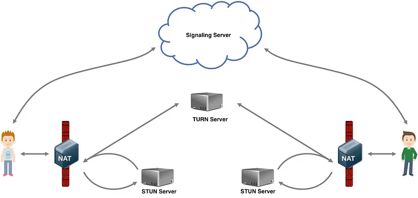
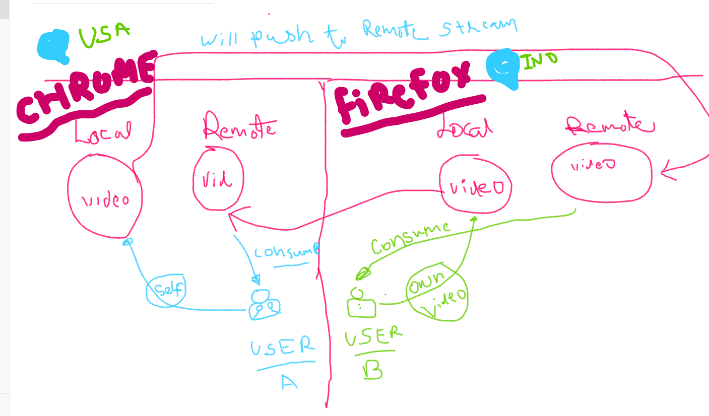

## kingChat- a realtime video & chat streaming plateform!

## System Design & Analysis of Zoom

[Analysis of zoom with diagram](https://app.eraser.io/workspace/1VAt6dq08nA83vf4VOpa?origin=share)

## Features of kingChat
<h2> User Interface </h2>
The following includes some popular UI features present in kingChat:

1. User Management: This allows users to display general information such as a phone number and picture on their personal profiles. More complex user profiles may contain in-app purchase tools and payment integrations.

2. Contacts Management: All modern video calling apps have a contacts management feature that allows users to add, search and delete contacts.

3. Status: The status feature notifies users about the online status of other users. This can prevent users from wasting time calling people that are not currently online. From a simple online/offline status to WhatsApp’s last seen feature, status functionalities are a must-have in most cases.

4. Text Chat: Users can save time by texting instead of calling for simple questions or status updates. Furthermore, apps that combine both video and text are usually more successful.

4. Group Calls: Most office meetings have transformed into virtual meetings using the group conferencing feature. Therefore, implementing group calls is a great way to attract businesses that are focusing on maintaining operations through remote work.

5. Screen Sharing: To build upon virtual meetings, a screen sharing feature allows users to share their work during a call. Furthermore, screen sharing can increase the effectiveness of communication, especially for remote workers.

6. Push Notifications: With these, users can check for new messages or missed calls by simply sliding the notification bar on a locked screen.
## **Task Break-up!**

| Sl No. | Task                        | Status                  |
|--------|-----------------------------|-------------------------|
|   1    | Front-end      |         done          |
|   2    | WebRTC    |                         |
|   3    | Color on voice                |                         |

## **Tools/Technology Used!**

| Sl No. | Tools/Library                    | 
|--------|-----------------------------|
|   1    | ReactJS |     
|   2    | TypeScript    |                       
|   3    | Tailwind-CSS |               
|4| WebRTC |
|5| SocketIO |

## **To run this project locally**

  Step-1.  Clone this repo in your local machine.  
  Step-2.  Run `npm install`.   
  Step-3   Run `npm run dev`.

 ## **Learning**

  1. Routing creation using react-router-dom.
  2. How to add div in remaining screen if some div already occupied the screen,without overflow in ***Tailwind-CSS***
     `flex flex-col` (parent div) -> div 1 -> `flex-1`(div2 for remaining space)
  3.  How does the WebRTC work .
  4. flex-wrap,  h-[${activeContent}%] 

## **Challenges**

   1. Screen share when not popped-up user profile div content should scroll.
   2. `peer-to-peer` connections for small group to share data in `WebRTC` eg- a)P2P b) Mesh Network  c) SFU . 

## **Working Strategy**
   
   1. Created Front-End UI, then
   2. Started working in Back-End.
  
 ## **Refrences** 
 
## **Getting familiar with WebRTC**

Go through the readme file provided by documentation 
[see this->]().
  `webrtc.txt` file is also being attached in the same diroctory. 

[ How does WebRTC work?](https://medium.com/agora-io/how-does-webrtc-work-996748603141#id_token=eyJhbGciOiJSUzI1NiIsImtpZCI6IjQ4YTYzYmM0NzY3Zjg1NTBhNTMyZGM2MzBjZjdlYjQ5ZmYzOTdlN2MiLCJ0eXAiOiJKV1QifQ.eyJpc3MiOiJodHRwczovL2FjY291bnRzLmdvb2dsZS5jb20iLCJhenAiOiIyMTYyOTYwMzU4MzQtazFrNnFlMDYwczJ0cDJhMmphbTRsamRjbXMwMHN0dGcuYXBwcy5nb29nbGV1c2VyY29udGVudC5jb20iLCJhdWQiOiIyMTYyOTYwMzU4MzQtazFrNnFlMDYwczJ0cDJhMmphbTRsamRjbXMwMHN0dGcuYXBwcy5nb29nbGV1c2VyY29udGVudC5jb20iLCJzdWIiOiIxMDQxMDc4MjE5MjU3OTQzNzkxNDYiLCJlbWFpbCI6ImFzaGlzaC5rdW1hci5zaW5naC5qZWVAZ21haWwuY29tIiwiZW1haWxfdmVyaWZpZWQiOnRydWUsIm5iZiI6MTcwNjA5ODYxOCwibmFtZSI6IkFzaGlzaCBLdW1hciIsInBpY3R1cmUiOiJodHRwczovL2xoMy5nb29nbGV1c2VyY29udGVudC5jb20vYS9BQ2c4b2NLYkZrc1NEbUZYOXNZdGVOR2FpSTBrVXZnTWsxNXpiM3lZTnFrWUhBVzFLUk09czk2LWMiLCJnaXZlbl9uYW1lIjoiQXNoaXNoIiwiZmFtaWx5X25hbWUiOiJLdW1hciIsImxvY2FsZSI6ImVuLUdCIiwiaWF0IjoxNzA2MDk4OTE4LCJleHAiOjE3MDYxMDI1MTgsImp0aSI6IjhhNTU5OTI3NDBiY2VkNTZmZTZlM2I3NDEwZTMyODAyMDUyMmU0MGIifQ.bL5qXLgpRsXheAoNWNcE4INtqSEMqRhoFf5r1pVPxV-8Dwlv1LgYwKshrcYlhTBenupQTqk92EhfXqYfqn3YIz50kF3NVigSSIreWqKzPRA02YFWKsYjnol-7zCxP4qpqg2jPj1am4o9c6uYyHcDdYT6N3CDcA29CS1FzrTnGjFeAdmMDBiZMBPDti6d-4bTClphAhkSYmDCtzNWVCUQBdWuJMVJHleCsZaMHm7RGj4K36k8_YHVinR8s5I0eOvTx9DyqSXvgGilZrTqFFyOFReM3rby3iALUP5Gu57R8158WGziyg5gezL8ncc5bJQgeUU4NtBv_b8yuTiaCc_31w )

What are STUN, TURN, and ICE?

Local Media Stream is being sent to Remote Media Stream and the Remote Media Stream that are coming is being consumed(played).

## WebRTC Media Streaming Concept
At the top level, WebRTC media streaming occurs in four phases:

1. Offer.
2. Signaling.
3. Answer.
4. Data exchange between two browsers.  

WebRTC uses Session Description Protocol(SDP) to create an offer and answer mechanism. SDP provides a profile of your device to other users trying to connect to you. SDP is a text-based protocol, that contains information about the type of media stream, codec, transport layer, and other information.

To make an offer, a WebRTC peer connection object is created and takes an optional parameter. The optional parameter contains the configuration for the Interactive Connectivity Establishment Protocol(ICE) servers. ICE finds the shortest path for media to travel between two peers. ICE helps devices connect across the internet, and overcome NAT(Network Address Translator), firewalls, and anything that can hinder peer-to-peer communication.

For devices to communicate over the internet, they utilize IP addresses and port numbers. However, most devices operate behind a firewall or NAT that hides their IP addresses, thus preventing peer-to-peer communication. During ICE gatherings, ICE allows devices to exchange potential network addresses called ICE candidates. The candidates contain IP addresses, port numbers, and transport protocols. A computer device can have multiple ICE candidates. ICE protocol then decides the best network path for a session using the information provided by ICE candidates. Devices exchange ICE candidates using the ICE servers. There are two types of ICE servers

1. Session Traversal Utilities for NATS(STUN)
2. Traversal Using Relay around NATS(TURN)

Turn servers are used in a more restrictive network when both peers are behind a firewall, NAT, or symmetric NAT that prevents direct communication between devices.

## Advantages of WebRTC

High communication quality
Automatically adjusts to any type of connection.
Automatic microphone sensitivity (AGC) control for all connections.
All connections are protected (HTTPS) and encrypted (SRTP).
WebRTC application works on desktop or mobile operating systems provided it has browser support.

## Drawbacks of WebRTC

Audio and video mixing to run group audio or video conferences.
WebRTC solutions are incompatible with each other.

Vendors decide on signaling, messaging, file transfer, conference scheduling, etc. No uniformity in signaling or messaging.

## WebRTC Setup

We mentioned earlier that peer-to-peer connections in WebRTC occur through an offer-and-answer mechanism. A peer(caller) creates an instance of the RTCPeerConnection object and passes it an optional configuration object that contains the iceServers. The RTCPeerConnection creates an offer and sets the offer as its local session description, emits the offer to the remote peer through the signaling server. The caller uses the browser API getUserMedia to access the device media. Then attaches the media stream and ice candidates to the RTCPeerConnection.

The remote peer(callee) will also create an instance of the RTC peer connection. when the callee receives an offer, it will set its remote session description to the offer, create an answer, set the answer as its local session description. The callee will send the answer to the caller through the signaling server. The callee would also attach its media stream and ice candidate to the peer connection.

The connection between the caller and callee can only take place after they have both exchanged ice candidates. We mentioned before that ice candidates are potential network addresses that peers can use to communicate with one another. The caller would send its ice candidate to the callee through the signaling server and listen for the ice candidate of the callee, when the caller receives the ice candidate of the callee, it will add it to the RTCPeerConnection. The callee would also repeat this process.

## Socket.IO concepts

Socket.IO is a library that facilitates bi-directional low-latency communication between the client and the server. The communication between the client and server is events-based. The client and the server emit and listen to events. To use Socket.IO, the client and the server library must be installed on the client and server. Socket.IO is used for applications that depend on real-time data like the stock market, weather, and chat applications. Socket.IO is implemented in most major languages, Python, Java, and C++. In this article, we used JavaScript implementation for both the client and server side.

## Advantages of Socket.IO

Multiple namespaced streams down a single engine.io session. Encoding of messages as named JSON and binary events.
Acknowledgment callbacks per event

## Drawbacks of Socket.IO

Socket.IO doesn't provide end-to-end encryption.
Socket.IO does not guarantee exact-once messaging semantics. By default, an at-most-once guarantee is provided.

[more details for p2p connection!](https://www.w3.org/TR/webrtc/#dom-rtcconfiguration-icecandidatepoolsize)